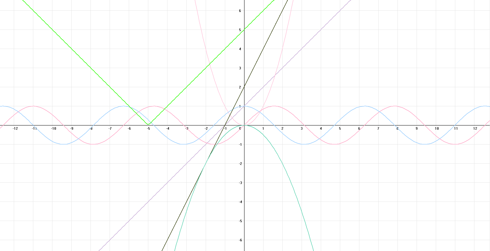

### visgraphs

**visgraphs** — это приложение для визуализации математических функций и графиков с возможностью динамического масштабирования и смещения. Приложение поддерживает различные типы функций, с возможностью добавления новых внутри кода.

## Особенности:
- Возможность двигать графики с помощью ЛКМ.
- Динамическое масштабирование графиков с использованием колесика мыши.
- Поддержка различных типов математических функций и создание новых внутри кода.

## Установка:
1. Клонируйте репозиторий:
   ```bash
   git clone https://github.com/pharci/visgraphs.git
   ```
2. Соберите проект с помощью выбранной среды разработки.

## Скриншоты:


---

Писать сюда [@pharc1](https://t.me/pharc1).
